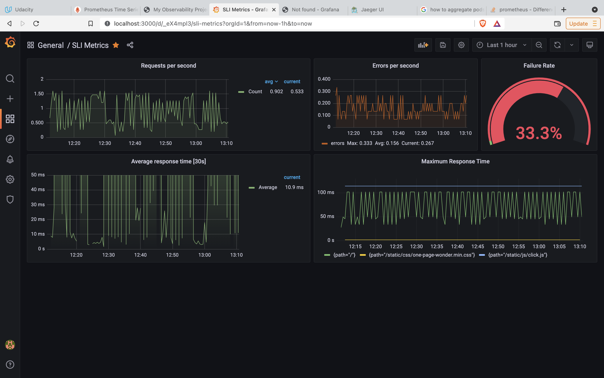

**Note:** For the screenshots, you can store all of your answer images in the `answer-img` directory.

## Verify the monitoring installation
*TODO:* run `kubectl` command to show the running pods and services for all components. Take a screenshot of the output and include it here to verify the installation

**Answer:**

## Setup the Jaeger and Prometheus source
*TODO:* Expose Grafana to the internet and then setup Prometheus as a data source. Provide a screenshot of the home page after logging into Grafana.

**Answer:**

## Create a Basic Dashboard
*TODO:* Create a dashboard in Grafana that shows Prometheus as a source. Take a screenshot and include it here.

**Answer:**

## Describe SLO/SLI
*TODO:* Describe, in your own words, what the SLIs are, based on an SLO of *monthly uptime* and *request response time*.

**Answer:**

_The application will be operational and responding successfully to requests 99.99% of the time in a given month_

_Average API response latency is less than 200ms_  

## Creating SLI metrics.
*TODO:* It is important to know why we want to measure certain metrics for our customer. Describe in detail 5 metrics to measure these SLIs. 

**Answer:**

* Metrics for Request Response Time:

_Average HTTP Response time grouped per time interval (e.g. per 30s)_

_Maximum HTTP Response Time grouped per time interval (e.g. per 30s)_

* Metrics for Uptime:

_Number of success HTTP responses per second_

_Number of 500x error HTTP responses per second_

_Number of 400x error HTTP responses per second_

_Number of error HTTP responses per second divided by the total number of HTTP calls per second (Failure Rate)_  

## Create a Dashboard to measure our SLIs
*TODO:* Create a dashboard to measure the uptime of the frontend and backend services We will also want to measure to measure 40x and 50x errors. Create a dashboard that show these values over a 24 hour period and take a screenshot.

## Tracing our Flask App
*TODO:*  We will create a Jaeger span to measure the processes on the backend. Once you fill in the span, provide a screenshot of it here. Also provide a (screenshot) sample Python file containing a trace and span code used to perform Jaeger traces on the backend service.

**Jaeger Spans**

**Jaeger API Span**

**Jaeger Homepage Span**

**Jaeger Source Code Part 1**

**Jaeger Source Code Part 2**

## Jaeger in Dashboards
*TODO:* Now that the trace is running, let's add the metric to our current Grafana dashboard. Once this is completed, provide a screenshot of it here.

## Report Error
*TODO:* Using the template below, write a trouble ticket for the developers, to explain the errors that you are seeing (400, 500, latency) and to let them know the file that is causing the issue also include a screenshot of the tracer span to demonstrate how we can user a tracer to locate errors easily.

TROUBLE TICKET

Name: Error on /star endpoint

Date: 27/12/2021 1:58PM

Subject: /star enpoint takes over 30s to finish 

Affected Area: /star backend api

Severity: High

Description: Post to /star endpoint with payload below take more than 30s to respond and produces error: 

{
    "name": "North Star",
    "distance": 1000
}

## Creating SLIs and SLOs
*TODO:* We want to create an SLO guaranteeing that our application has a 99.95% uptime per month. Name four SLIs that you would use to measure the success of this SLO.

**Answer**

_Percentage of time for which containers were up and running_

_Number of 400x errors over time_

_Number of 500x errors over time_

_Percentage of Errors compared to total number of requests (i.e. Failure Rate)_

## Building KPIs for our plan
*TODO*: Now that we have our SLIs and SLOs, create a list of 2-3 KPIs to accurately measure these metrics as well as a description of why those KPIs were chosen. We will make a dashboard for this, but first write them down here.

**Answer**

_Failure Rate should be less than 0.05%_

_Container should be up and running at least 99.95% of the time for all applications (frontend and backend)_

_No 400x or 500x errors detected_

## Final Dashboard
*TODO*: Create a Dashboard containing graphs that capture all the metrics of your KPIs and adequately representing your SLIs and SLOs. Include a screenshot of the dashboard here, and write a text description of what graphs are represented in the dashboard.  

